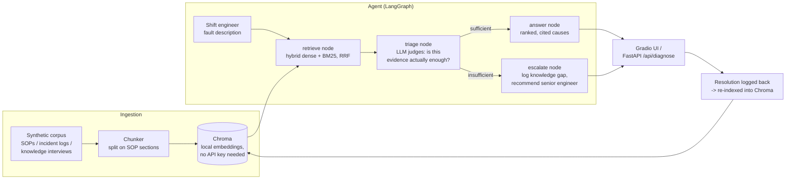

# Continuity

**A RAG-based institutional knowledge-capture and fault-diagnosis assistant — an independent portfolio PoC built in the style of a Forward Deployed Engineer prototype.**

> ⚠️ **Scope disclaimer, read first:** This is an independent project built from public reporting. It does not use, and does not claim to use, any real TSMC internal data, SOPs, or systems. Every document in its knowledge base — SOPs, incident logs, and knowledge-capture interviews — is synthetic, written to be *representative* of the kind of institutional knowledge that is put at risk industry-wide when experienced engineers rotate out on fixed-term assignments. It demonstrates a prototyping pattern applied to a real, sourced, company-acknowledged problem — it is not a claim to have solved that problem or to understand TSMC's internal operations from the outside.

---

## The problem this targets

TSMC has itself named workforce continuity as one of its most acute challenges in the Arizona buildout — not a hypothesis from outside the company, but its own repeated, on-the-record statement:

- **May 2026 (TrendForce):** TSMC flagged four key challenges in the Arizona buildout — utilities, regulatory complexity, visa delays, and, described in the most detail, labor shortage: "more than 1,000 Taiwanese engineers... are now approaching the end of their [three-year] contracts," with talent shortages "likely to persist, given the limited local manufacturing talent pool." ([TrendForce](https://www.trendforce.com/news/2026/05/12/news-tsmc-flags-four-key-challenges-in-arizona-buildout-even-as-u-s-fab-beats-expectations/))
- **2023 earnings call:** Chairman Mark Liu: "We are encountering certain challenges, as there is an insufficient amount of skilled workers with the specialized expertise required for equipment installation in a semiconductor-grade facility... sending experienced technicians from Taiwan to train local skilled workers for a short period of time." (AnandTech, earnings-call coverage)
- **Q3 2025:** a gas-supplier power outage caused hours of downtime, scrapped thousands of wafers, and cut quarterly profit by 99% at the Arizona fab. (Digitimes, Jan 2026)
- **Analysis:** the recurring structural read is a "governance architecture" and "workforce formation system" gap — the tacit knowledge and authority structure built in Taiwan over decades doesn't yet exist in the Arizona operation. (Oxxegen Insights, Mar 2026)

This is a multi-year, multi-source, company-acknowledged pattern, not a one-off incident. Continuity is a prototype of the kind of tool a Forward Deployed Engineer would build and iterate on with domain experts in response to a pattern like this: capture what a rotating engineer knows before they leave, and surface it back to whoever is holding the pager next, at the moment they actually need it — a 2am fault, not a training binder nobody has time to read.

## What it actually does

A shift engineer describes a fault symptom in plain language. Continuity retrieves the most relevant SOP sections, past incident logs, and — critically — knowledge-capture interview transcripts (simulating what you'd extract from a senior engineer before a rotation ends), and returns a ranked, cited list of likely causes and recommended next actions. When the knowledge base genuinely doesn't cover the fault, it says so explicitly and logs the gap, instead of guessing — that refusal-to-guess behavior is the actual point, not a limitation to hide.

## Competitive landscape (why this isn't a novel category, and what it's testing anyway)

RAG-over-maintenance-docs for industrial/fab equipment is an existing, real product category — e.g. People10's "AI-Powered Equipment Troubleshooting Copilot" (hybrid RAG + agentic AI, claiming 30–50% troubleshooting-time reduction) and several open-source "industrial maintenance copilot" projects. Continuity doesn't claim to out-innovate those. What it's specifically testing is different: **knowledge-gap detection tied to a documented workforce-rotation risk**, evaluated against a published, domain-specific RAG benchmark (below) rather than ad hoc criteria — the FDE motion of identifying a real operational pattern and prototyping directly against it, not a general-purpose maintenance chatbot.

## Architecture



**Choices and why**, since an FDE interview will ask about each of these directly:

| Decision | Choice | Why |
|---|---|---|
| Vector store | **Chroma**, local default embedding function (ONNX MiniLM) | JD-named; zero API key / zero cost for indexing and dense retrieval — Pinecone's account dependency and Milvus's ops overhead are both unjustified at this scope. |
| Retrieval | **Hybrid dense + BM25 with Reciprocal Rank Fusion** | Fault descriptions contain exact tokens (tool IDs, error codes) that dense embeddings under-weight; pure BM25 misses paraphrased symptoms. The real commercial products in this space use the same hybrid pattern for the same reason. |
| Agent orchestration | **LangGraph**, typed state, forced tool-use for structured output | The JD lists LangChain generically; LangGraph is LangChain's own current answer for stateful agents. The triage→route step is genuine agentic decision-making (route to answer vs. escalate), not a fixed RAG chain. |
| Generation | **Anthropic API**, forced tool-use (not prompted JSON) | JD-named; tool-use gives validated structured output instead of regexing JSON out of free text. |
| Backend | **FastAPI** | JD-named; real Pydantic schemas, a `/api/diagnose` and `/api/cases/resolve` surface independently callable over HTTP — not just glued to the UI. |
| Frontend | **Gradio**, mounted onto the FastAPI app | JD-named low-code/rapid-prototyping framework; mounting keeps this one deployable service instead of two. |
| Eval | **FAB-Bench-style**, six dimensions | Modeled on a peer-reviewed 2026 RAG benchmark built specifically for semiconductor manufacturing (arXiv:2605.26476), not invented criteria. |

## The knowledge base (synthetic)

20 documents across five representative fab tool types (plasma etch, PECVD deposition, CMP, lithography, diffusion furnace): 5 SOPs, 10 incident logs, and 5 knowledge-capture interviews. The interviews are the thesis made concrete — each one contains a piece of tacit, undocumented operating knowledge (e.g., a purge-cycle sound change that precedes a pump failure by weeks; a seasonal humidity correlation with showerhead clogging) that exists nowhere in the written SOPs or incident logs, and would simply leave with the engineer if nobody captured it first. See `data/synthetic/`.

## Evaluation

`data/eval/fault_scenarios.json` has 16 hand-authored fault scenarios: 13 map to specific documents in the corpus (with ground-truth relevant `doc_id`s for retrieval metrics), and 3 are deliberate coverage gaps (equipment or fault types genuinely not in the corpus) to test whether the agent correctly escalates instead of fabricating a plausible-sounding answer.

Metrics, modeled on **FAB-Bench** (arXiv:2605.26476), a benchmarking framework built specifically for RAG systems in semiconductor manufacturing:

- **Retrieval quality** — precision@k, recall@k, MRR, computed deterministically against hand-labeled ground truth (no LLM judge, no API key needed — run with `--dry-run`).
- **Answer relevance, factual accuracy, completeness, reasoning clarity, domain specificity** — LLM-judged (Claude) 1–5 against a human-authored reference answer per scenario.
- **Escalation accuracy** — did the agent correctly recognize the 3 gap scenarios as gaps, and correctly *not* escalate on the 13 covered ones.

Run it yourself:
```bash
python scripts/run_eval.py --dry-run   # retrieval only, no API key
python scripts/run_eval.py             # full agent + FAB-Bench-style judging, needs ANTHROPIC_API_KEY
```

**Actual retrieval results** (`--dry-run`, no API key, reproducible by anyone who clones this repo), averaged over all 16 scenarios:

| Metric | Score |
|---|---|
| Precision@5 | 0.59 |
| Recall@5 | 0.94 |
| MRR | 0.71 |

Two honest findings worth naming rather than smoothing over: recall@5 is 1.0 on every one of the 13 covered scenarios individually (the correct document is always somewhere in the top 5) — the 0.94 average is pulled down only by the 3 deliberate gap scenarios, where recall is a trivially-satisfied 1.0 against an empty relevant set and uninformative on its own. More interesting: MRR is consistently 1.0 on scenarios sourced from incident logs (direct symptom → direct past fix), but drops to 0.33–0.5 on the scenarios that require surfacing a knowledge-capture interview (the tacit-knowledge cases) — retrieving indirectly-phrased tacit knowledge ranks it lower than retrieving a directly-matching incident log, which is itself a small piece of evidence for why this knowledge is the kind that's easy to lose: it's also the kind that's hardest to surface first.

Also confirmed empirically: the cheap numeric score-gate (`MIN_FUSED_SCORE_THRESHOLD`) never fires on any of the 16 scenarios, including the 3 gap scenarios — the corpus is small enough that BM25/dense retrieval always returns *something* with a nonzero fused score, even when nothing is actually relevant. That's not a bug; it's the empirical justification for why the triage step has to be a real LLM semantic judgment rather than a numeric cutoff — a threshold alone cannot detect these gaps on this corpus.

The five LLM-judged FAB-Bench dimensions (answer relevance, factual accuracy, completeness, reasoning clarity, domain specificity) and escalation accuracy require `ANTHROPIC_API_KEY` to run — see [`eval_results.json`](eval_results.json) for whichever numbers were most recently generated; regenerate it after any change to the corpus, prompts, or retrieval logic rather than trusting a stale copy.

## Setup

```bash
cd continuity
python3 -m venv .venv && source .venv/bin/activate
pip install -e .
cp .env.example .env   # add your ANTHROPIC_API_KEY

python scripts/ingest.py          # builds the Chroma index (no API key needed)
python scripts/run_eval.py --dry-run   # sanity-check retrieval

uvicorn continuity.api.main:app --reload   # serves the Gradio UI at / and the API at /api/*
```

Then open `http://localhost:8000`.

## Deployment

Deployed on **Render** as a Docker web service — live at: **[TODO: paste Render URL once live]**

`Dockerfile` builds the retrieval index at image build time (local embedding model, no API key needed for this step) and serves both the UI and API from one process. It reads `$PORT` at container start rather than a fixed port, since Render (like most PaaS platforms) assigns that dynamically — the process binds to whatever Render tells it to, not a hardcoded value. `render.yaml` declares the service as a Blueprint: Docker runtime, free plan, health check at `/api/health`, and `ANTHROPIC_API_KEY` marked `sync: false` so Render requires it to be entered directly in the dashboard rather than ever living in git.

The image was built and run locally against an arbitrary non-default `$PORT` before deploying, specifically to catch two real Docker footguns before Render would have surfaced them less legibly: an exec-form `CMD` can't expand `$PORT` at all (it needs shell-form or an explicit `sh -c`), and a bare shell-form `CMD` makes the shell PID 1 instead of uvicorn, so Render's SIGTERM on redeploy doesn't reach the app cleanly. Fixed by using `CMD ["sh", "-c", "exec uvicorn ..."]` — the `exec` replaces the shell with uvicorn so it becomes PID 1 and shuts down promptly on SIGTERM (verified: <1s).

One free-tier caveat worth being upfront about: Render's free web services spin down after inactivity, so the first request after idle time cold-starts slowly (tens of seconds). A recruiter clicking the link cold will see that delay — not a bug, just the tradeoff of a $0 hosting tier for a portfolio demo.

## Path to production (explicitly out of scope here)

This is a PoC, not a production system — naming that boundary is itself part of the JD's "partner with core IT and MLOps to transition prototypes into production-ready systems." Before this could run against real fab data, it would need: authentication and role-based access control; real data governance and PII/IP review on anything ingested; a persistence layer beyond local JSONL files for logged gaps and resolved cases (the current write-back demo — resolving a case, flagging a gap — writes to the container's local disk, which Render's free tier does not persist across restarts or redeploys; a real deployment needs an actual database here, not just more disk); monitoring and alerting on escalation rate and judge-score drift; a human-review gate before any generated diagnosis reaches a live equipment action; and load-tested deployment beyond a single-process demo.

## Repo layout

```
continuity/
├── data/synthetic/         # 20 synthetic SOPs / incident logs / interviews
├── data/eval/               # 16 fault scenarios with graded reference answers
├── src/continuity/
│   ├── retrieval/            # chunking, Chroma vectorstore, hybrid BM25+dense RRF
│   ├── agent/                # LangGraph state machine, tools, prompts
│   ├── eval/                  # FAB-Bench-style metrics + harness
│   ├── api/                   # FastAPI routes/schemas
│   └── ui/                    # Gradio interface
├── scripts/                  # ingest.py, run_eval.py
└── tests/
```
